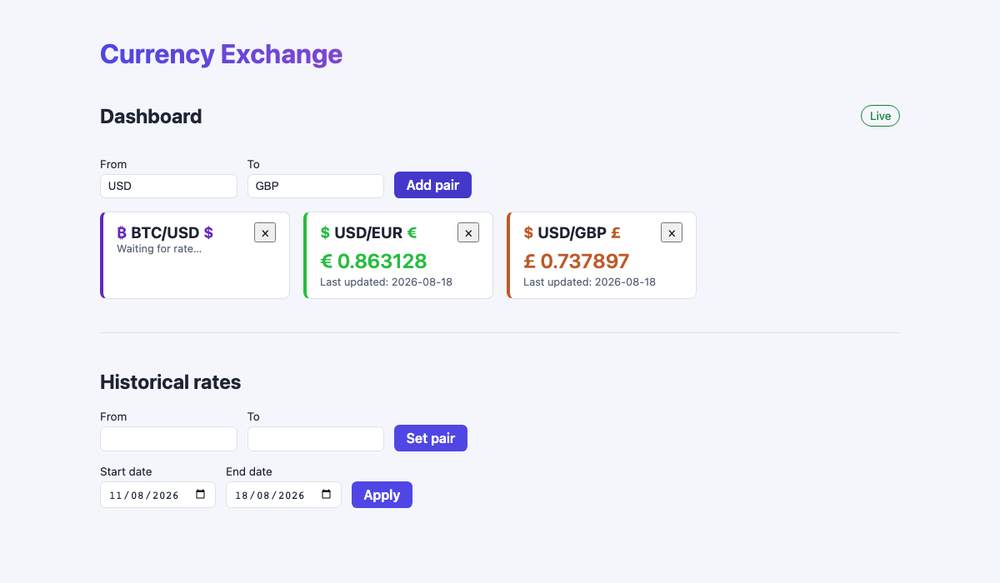
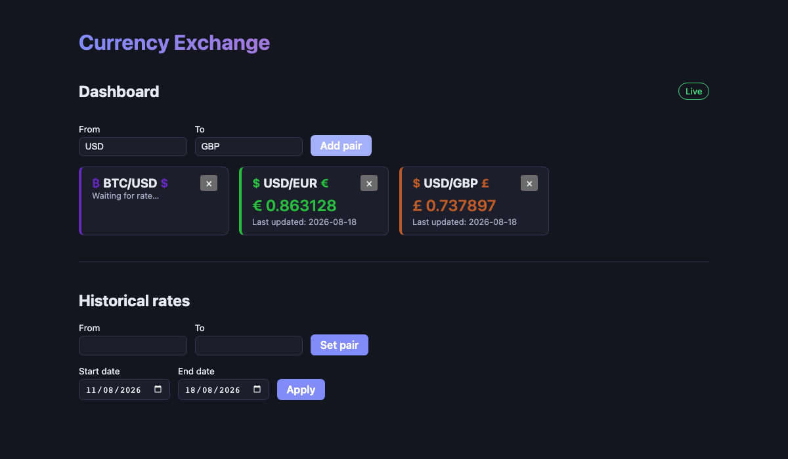
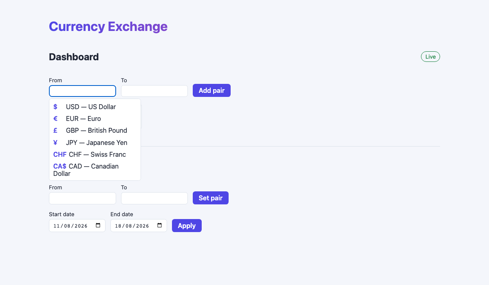
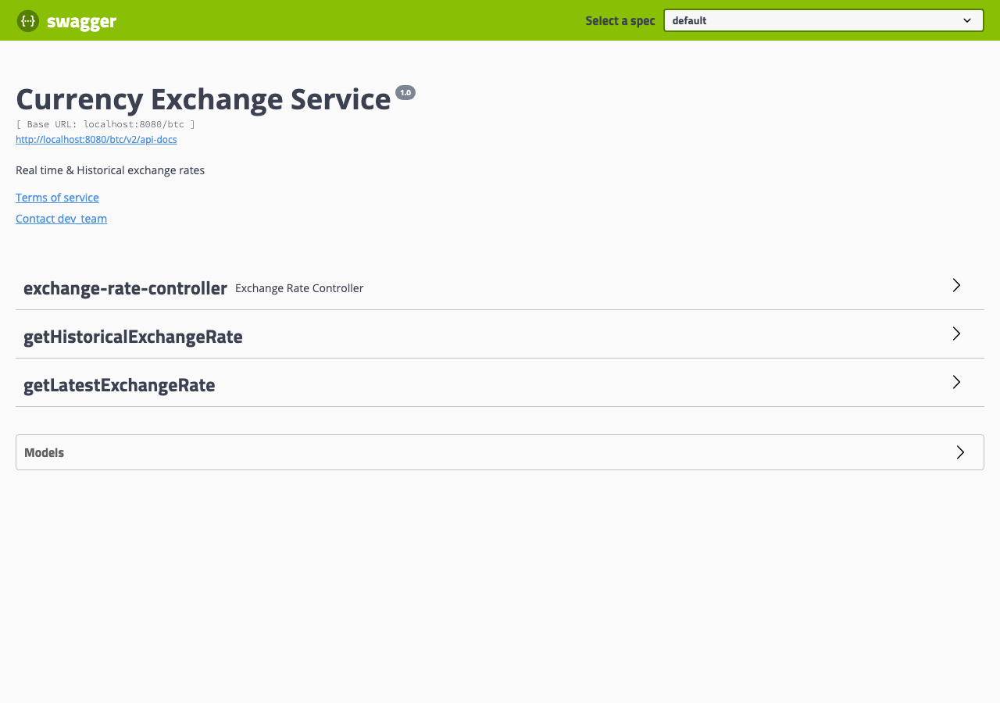
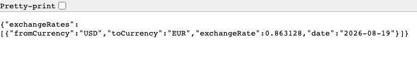
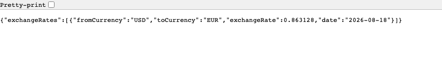
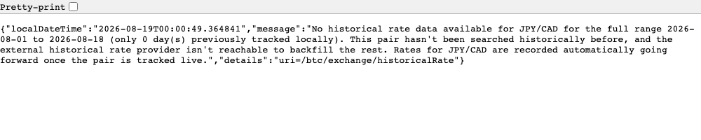

# currency-exchange-service

A full-stack live currency exchange platform: a Spring Boot REST + WebSocket backend serving
real-time and historical rates for **any** currency pair, and a React dashboard that tracks
multiple pairs live and charts their history.



## Features

- **Live rates for any pair**, `USD/EUR`, `BTC/USD`, `INR/JPY` — created on demand, no fixed
  currency list. Backed by a free, keyless rate provider for fiat pairs, falling back to
  CryptoCompare for crypto.
- **Real-time push over WebSocket** (STOMP/SockJS) — subscribe to a pair and get updates without
  polling.
- **Historical rate charting**, backed by a durable H2 store that accumulates real data for every
  pair tracked live, so lookups get cheaper (and richer) over time.
- **A dashboard you'd actually want to use** — a multi-pair tracker with a currency picker,
  per-pair color accents and symbols, dark mode, and a standalone historical chart.

## Screenshots

| Light | Dark |
| --- | --- |
|  |  |





| Live rate (no key needed) | Historical, tracked pair | Historical, untracked pair |
| --- | --- | --- |
|  |  |  |

The third response shows the meaningful `HistoricalRateUnavailableException` message (see
Decisions below) instead of the raw upstream exception, for a pair with no accumulated history yet.

More frontend screenshots and its own decisions: [frontend/README.md](frontend/README.md).

## Tech stack

**Backend**: Java 11, Spring Boot 2, Spring WebSocket (STOMP/SockJS), Hystrix, Spring Data JPA +
H2 (file-based) + Flyway, Caffeine caching, Springfox/Swagger, Maven, Docker.
**Frontend**: React, TypeScript, Vite, `@stomp/stompjs` + `sockjs-client`, Recharts, Vitest +
React Testing Library.

## Getting started

**Backend** (repo root):
```bash
mvn spring-boot:run
```
Runs on `http://localhost:8080/btc`.
- Swagger UI: `http://localhost:8080/btc/swagger-ui.html`
- H2 console: `http://localhost:8080/btc/h2-console/login.jsp` — JDBC URL
  `jdbc:h2:file:./data/bitcoindb;AUTO_SERVER=TRUE`, user/pass `bitcoin_exchange`/`bitcoin_exchange`

Or build + run in Docker: `sh start.sh`.

```bash
mvn clean package                                    # build
mvn test                                             # run tests
mvn test -Dtest=ExchangeRateServiceTest               # single test class
mvn test -Dtest=ExchangeRateServiceTest#methodName    # single test method
```

**Frontend** (`frontend/`):
```bash
npm install
npm run dev      # dev server on :5173, proxying /btc to the backend on :8080
npm run build    # typecheck + production build
npm run test     # Vitest + React Testing Library
```
Run both together for a working local setup — see [frontend/README.md](frontend/README.md) for
more.

## API

Two endpoints under `/exchange` (`ExchangeRateController`):

| Endpoint | Description |
| --- | --- |
| `GET /exchange/liveRate?from=&to=` | Current rate for a pair. Tries the free provider first, falls back to CryptoCompare. |
| `GET /exchange/historicalRate?from=&to=&startDate=&endDate=` | DB-first; fetches missing dates from CryptoCompare when possible, otherwise a meaningful 404 (see Decisions). |

Plus STOMP over SockJS at `/btc/ws` — `SUBSCRIBE /topic/rates/{FROM}/{TO}` (uppercase) for live
pushes.

## Architecture

`ExchangeRateController` delegates to `ExchangeRateService` (the core engine), backed by the
static helper `ExchangeRateUtil` and `CurrencyPairService` (creates `Currency`/`CurrencyPair` rows
on first use of a pair — no seeding, no fixed pair list).

**Live rate**: `ExchangeRateService.fetchExchangeRates` tries the free provider
(`ExchangeRateApiProviderService`, wraps `https://open.er-api.com/v6/latest/{base}`) first — no
key, but fiat-only, cached per base currency for 24h. Falls back to `realTime.exchangeAPI`
(CryptoCompare) for bases it doesn't cover or when it's unreachable. Separately,
`refreshSubscribedLiveRates` is `@Scheduled` and polls only actively WS-subscribed pairs
(`RateSubscriptionRegistry`), pushing updates via STOMP; a new subscriber gets an immediate push
instead of waiting for the next tick.

**Historical rate**: DB-first via `HistoricalExchangeRateRepository`. Missing dates are fetched
from CryptoCompare when possible; every live push also records that day's rate
(`HistoricalRateCacheService.recordTodaysRateIfMissing`), so any pair tracked live accumulates real
historical data going forward. Protected by a Hystrix circuit breaker (120s timeout, 502 fallback
on genuine timeout); domain exceptions bypass that fallback and reach the client as themselves.

**Caching**: two independent Caffeine caches (`CacheConfig`) — `liveRates` (per-pair, short TTL)
and `externalBaseRates` (per-base-currency, 24h TTL, provider failures not cached).

**WebSocket**: STOMP over SockJS at `/ws`. `RateSubscriptionRegistry` tracks active subscriptions,
enforces `websocket.maxActivePairs`, and fires an event on a pair's first subscriber.

## Decisions

- **Live-rate provider: exchangerate-api.com (free/open tier) as primary, CryptoCompare as fallback.**
  CryptoCompare's `realTime.exchangeAPI` (`min-api.cryptocompare.com/data/price`) now requires an
  API key we don't have, so every live-rate call was failing. [exchangerate-api.com's free/open
  endpoint](https://www.exchangerate-api.com/docs/free) (`GET https://open.er-api.com/v6/latest/{base}`)
  needs no key and returns rates for every target currency against one base in a single call, but
  it's **fiat-only** (a crypto base like `BTC` comes back `{"result":"error","error-type":"unsupported-code"}`)
  and only refreshes once every 24h.
  `ExchangeRateApiProviderService.getRatesForBase(from)` calls it first; `ExchangeRateService`
  uses that result only if every requested `to` currency is present in it, otherwise falls back to
  the existing `realTime.exchangeAPI` (CryptoCompare) call unchanged. This means fiat pairs
  (`USD/EUR`, `USD/GBP`, ...) now get real live rates with no key needed, while crypto pairs
  (`BTC/USD`, ...) keep the prior CryptoCompare behavior — including needing a key, since we don't
  have a free crypto-rate source wired in yet.
- **24h per-base cache, separate from the per-pair `liveRates` cache.** Since the provider updates
  once a day and one call covers every target currency for that base, responses are cached by
  `from` currency alone (`externalBaseRates`, TTL `externalRatesApi.cache.ttlSeconds`, default
  86400s) rather than per pair — so `USD/EUR` and `USD/GBP` share one cached call instead of two.
  Provider failures (network error, unsupported base) are **not** cached (`unless = "#result == null"`
  on the `@Cacheable`), so a transient outage doesn't lock out the fallback path for a full day.
  This is a second Caffeine cache alongside the existing `liveRates` one (`CacheConfig` now
  registers both via `registerCustomCache`, each with its own TTL from `application.properties`).
- **Historical rates: no free provider offers real historical FX data, so we build our own going
  forward instead.** exchangerate-api.com's free tier is latest-rates-only; historical data on
  either provider needs a paid plan. Since `publishLiveRate` already fires whenever a pair gets a
  live push (the WS-subscribed scheduled poll, or the immediate push on first subscribe),
  `HistoricalRateCacheService.recordTodaysRateIfMissing` now writes one `HistoricalExchangeRate`
  row per pair per day from that same path (guarded by `existsByCurrencyPairAndDate` so the ~10s
  poll doesn't hammer the DB, and a caught `DataIntegrityViolationException` for the race where two
  pushes land concurrently). This means any pair tracked live starts accumulating real historical
  data from that point forward — there's nothing for dates before a pair was first tracked, and
  that's inherent to not having a real historical data source, not a bug.
- **Historical rate failures: a dedicated `HistoricalRateUnavailableException` (404) instead of the
  raw upstream exception.** When requested dates aren't in the DB and the external
  `historical.exchangeAPI` (CryptoCompare) call fails, `getHistoricalRatesFromServer` now catches
  that specific `ExchangeRateFetchException` (not a bare `Exception`, so unrelated bugs aren't
  masked as "no data") and raises `HistoricalRateUnavailableException` with a message naming the
  pair, the requested range, how many days were already tracked locally, and that rates accumulate
  automatically once a pair is tracked live. It's added to the Hystrix `ignoreExceptions` list on
  `/historicalRate` (alongside the other domain exceptions) so it reaches the client as itself
  instead of being replaced by the generic Hystrix-timeout fallback text.
- **Fixed a latent Hibernate/H2 date read bug, surfaced by the above.** `HistoricalExchangeRate.date`
  columns were reading back one day off from what was actually stored (confirmed by querying the H2
  file directly) whenever the JVM's default timezone wasn't UTC at the moment the DB
  connection pool was created. The app already called `TimeZone.setDefault(UTC)`, but from an
  `@PostConstruct` method — which runs *after* Spring creates the DataSource/connection pool, so
  those connections (and H2's JDBC driver, whose date conversions fall back to
  `Calendar.getInstance()`/`TimeZone.getDefault()`) were already pinned to the original zone by the
  time the override ran. Moved the call to the first line of `main()`, before
  `SpringApplication.run(...)`, so every bean is created under a consistently-UTC default zone.
  This was never exercised before today since no historical write+read had ever succeeded in this
  environment (CryptoCompare always 401'd); it's not new, just newly visible.
